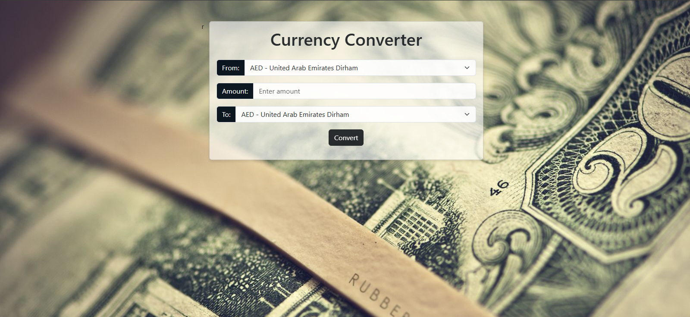

#  Currency Converter : Real-Time Exchange Rates

A sleek, **fully responsive** currency converter web app that delivers **real-time exchange rates** using free public APIs.  
Perfect for quick conversions, currency research, or embedding into finance-related websites.  


##  Why This Project Stands Out
- **Dynamic Currency List** : Automatically fetches & lists 160+ world currencies.
- **Real-Time Conversion** : Fetches the latest rates with a single click.
- **Modern UI** : Built with **Bootstrap 5** for a clean and responsive design.
- **Fast & Lightweight** : No heavy libraries, just HTML, CSS, and Vanilla JS.
- **Error Handling** : Clear feedback when inputs are missing or APIs fail.
- **Global Coverage** : Supports major & minor currencies worldwide.


## 📸 Preview

  


## 🛠 Tech Stack
| Technology   | Purpose |
|--------------|---------|
| **HTML5**    | Structure & layout |
| **CSS3 (Bootstrap 5)** | Styling & responsive design |
| **JavaScript (Vanilla)** | App logic & API integration |
| **Open Exchange Rates API** | Fetching currency codes & names |
| **ExchangeRate-API** | Fetching live exchange rates |


## ⚙️ How It Works
1. **Select currencies** from dynamically generated dropdowns.
2. **Enter the amount** you wish to convert.
3. **Click Convert** – instantly see results using live exchange rates.
4. Rates are updated every API call to ensure accuracy.


## 🚀 Getting Started
### 1 Clone the Repository
```bash
git clone https://github.com/yourusername/currency-converter.git
cd currency-converter
```
## 📜 License
This project is released under the **MIT License** – free for personal and commercial use.


## 👩‍💻 Author
**Fariha Shafiq**  
📧 farihashafiq396@gmail.com  
💼 [LinkedIn](https://www.linkedin.com/in/fariha-shafiq-01b81a210)
